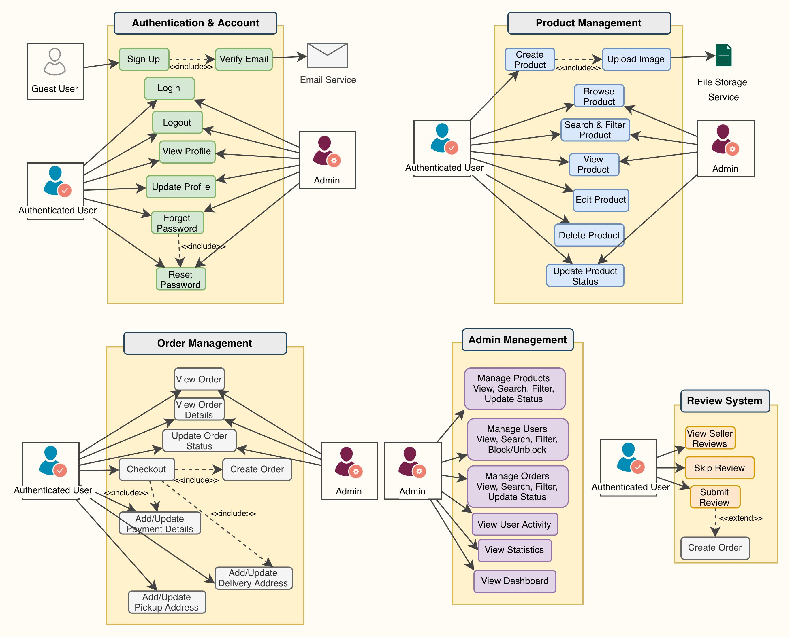
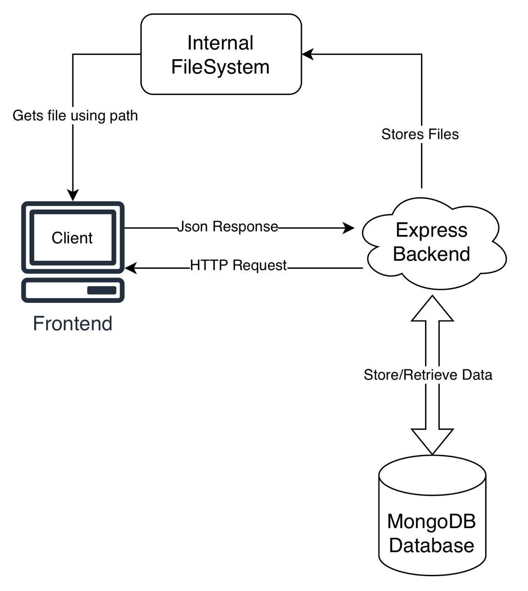
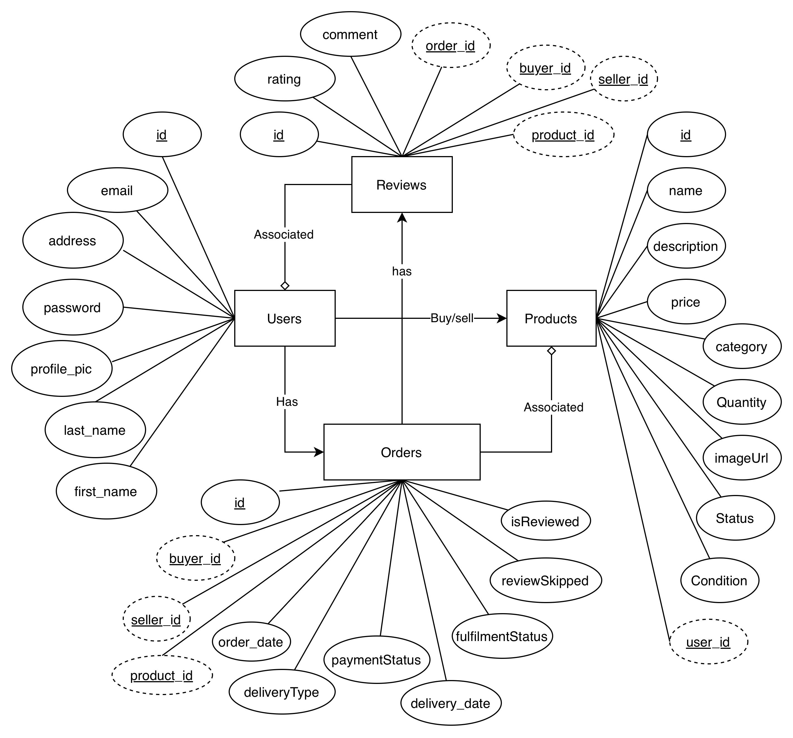

# StudentTradeHub - Technical Documentation

**Version:** 1.0.0  
**Last Updated:** Decmber 2025  
**Document Status:** Active

> **Note:** This documentation is maintained by the development team. For updates or feedback, see [Section 13: Documentation Maintenance](#13-documentation-maintenance).

---

## Table of Contents

1. [Project Overview](#1-project-overview)
2. [System Architecture](#2-system-architecture)
3. [Technology Stack](#3-technology-stack)
4. [Project Structure](#4-project-structure)
5. [Frontend Documentation](#5-frontend-documentation)
6. [Backend Documentation](#6-backend-documentation)
7. [Database Schema](#7-database-schema)
8. [API Reference](#8-api-reference)
9. [Authentication & Security](#9-authentication--security)
10. [Setup & Installation](#10-setup--installation)
11. [Testing](#11-testing)
12. [Deployment](#12-deployment)
13. [Documentation Maintenance](#13-documentation-maintenance)
14. [Glossary](#14-glossary)

---

## 1. Project Overview

### 1.1 Purpose

StudentTradeHub is a peer-to-peer marketplace platform exclusively for Memorial University of Newfoundland (MUN) students, enabling secure buying, selling, and trading within a verified community.

### 1.2 Core Features

| Feature | Description | Status |
|---------|-------------|--------|
| User Authentication | MUN email verification, JWT-based auth | ✅ Complete |
| Product Management | CRUD operations for listings | ✅ Complete |
| Search & Filter | Advanced search with multiple filters | ✅ Complete |
| Order Processing | Complete order lifecycle management | ✅ Complete |
| Review System | Post-transaction ratings and reviews | ✅ Complete |
| Admin Dashboard | User, product, and order management | ✅ Complete |
| Payment Integration | Secure payment method storage | ✅ Complete |
| Email Notifications | Verification and password reset emails | ✅ Complete |

### 1.3 Key Benefits

- **Security**: Verified student accounts reduce scams
- **Affordability**: Student-focused pricing
- **Community**: Trusted peer-to-peer transactions
- **Simplicity**: Streamlined buying/selling process

### 1.4 Use Case Diagram

---

## 2. System Architecture

### 2.1 High-Level Architecture


### 2.2 Architecture Patterns

| Pattern | Implementation | Location |
|---------|---------------|----------|
| **MVC** | Controllers handle business logic | `backend/controllers/` |
| **RESTful API** | Standard HTTP methods and status codes | [Section 8: API Reference](#8-api-reference) |
| **JWT Authentication** | Stateless token-based auth | [Section 9.1](#91-authentication-mechanism) |
| **Context API** | React state management | `frontend/context/` |
| **File-based Routing** | Next.js App Router | `frontend/app/` |

### 2.3 Data Flow

```
User Action → Frontend Component → API Call → Backend Route 
→ Controller → Database → Response → Frontend Update
```

See [Section 5.4: Frontend-Backend Integration](#54-frontend-backend-integration) for details.

---

## 3. Technology Stack

### 3.1 Technology Matrix

| Layer | Technology | Version | Purpose |
|-------|-----------|---------|---------|
| **Frontend Framework** | Next.js | 15.5.4 | SSR, routing, optimization |
| **UI Library** | React | 19.1.0 | Component-based UI |
| **Styling** | Tailwind CSS | 4 | Utility-first CSS |
| **Backend Runtime** | Node.js | ≥16 | JavaScript runtime |
| **Backend Framework** | Express.js | 5.1.0 | Web server framework |
| **Database** | MongoDB | Latest | NoSQL document store |
| **ODM** | Mongoose | 8.19.1 | MongoDB object modeling |
| **Authentication** | JWT | 9.0.2 | Token-based auth |
| **Password Hashing** | bcrypt | 6.0.0 | Secure password storage |
| **File Upload** | Multer | 2.0.2 | Multipart form handling |
| **Email** | Nodemailer | 7.0.11 | Email delivery |
| **Testing (Backend)** | Jest | 30.2.0 | Test framework |
| **Testing (Frontend)** | Jest + RTL | Latest | Component testing |

### 3.2 Development Tools

| Tool | Purpose |
|------|---------|
| Git | Version control |
| npm | Package management |
| Insomnia/Postman | API testing |
| MongoDB Compass | Database GUI |
| VS Code | Recommended IDE |

---

## 4. Project Structure

### 4.1 Directory Tree

```
StudentTradeHub/
├── Documentation/          # Project documentation
├── Timeline/              # Project planning & history
└── Web Application/       # Main application code
    ├── backend/           # Express.js API server
    │   ├── __tests__/    # Test files
    │   ├── controllers/  # Business logic
    │   ├── models/       # Database schemas
    │   ├── routes/       # API route definitions
    │   ├── middlewares/  # Request middleware
    │   ├── utils/        # Helper functions
    │   └── public/       # Static files
    └── frontend/         # Next.js application
        ├── __tests__/    # Test files
        ├── app/          # Next.js pages (App Router)
        ├── components/   # Reusable React components
        ├── context/      # React context providers
        └── libs/         # Utility functions
```

### 4.2 Key File Locations

| Component | File Path | Reference |
|-----------|-----------|-----------|
| Backend Entry | `backend/app.js` | [Section 6.1](#61-application-entry-point) |
| Frontend Entry | `frontend/app/layout.js` | [Section 5.2](#52-application-structure) |
| User Model | `backend/models/user.model.js` | [Section 7.1](#71-user-collection) |
| Auth Routes | `backend/routes/auth.routes.js` | [Section 8.1](#81-authentication-endpoints) |
| Auth Context | `frontend/context/AuthContext.js` | [Section 5.3.3](#533-context-providers) |

---

## 5. Frontend Documentation

### 5.1 Framework Overview

Built with **Next.js 15** using the App Router architecture, providing:
- Server-side rendering (SSR)
- File-based routing
- Automatic code splitting
- Optimized performance

### 5.2 Application Structure

#### 5.2.1 Routing Table

| Route | Page Component | Auth Required | Description |
|-------|---------------|---------------|-------------|
| `/` | `app/page.js` | No | Home page |
| `/login` | `app/login/page.jsx` | No | User login |
| `/signup` | `app/signup/page.jsx` | No | User registration |
| `/buy` | `app/buy/page.jsx` | Yes | Browse products |
| `/sell` | `app/sell/page.jsx` | Yes | Create listing |
| `/product/[pid]` | `app/product/[pid]/page.jsx` | Yes | Product details |
| `/checkout` | `app/checkout/page.jsx` | Yes | Checkout process |
| `/orders` | `app/orders/page.jsx` | Yes | Order history |
| `/orders/[id]` | `app/orders/[id]/page.jsx` | Yes | Order details |
| `/payment` | `app/payment/page.jsx` | Yes | Payment management |
| `/address` | `app/address/page.jsx` | Yes | Address management |
| `/admin` | `app/admin/page.jsx` | Admin | Admin dashboard |
| `/admin/products` | `app/admin/products/page.jsx` | Admin | Product management |
| `/admin/orders` | `app/admin/orders/page.jsx` | Admin | Order management |
| `/admin/users` | `app/admin/users/page.jsx` | Admin | User management |

#### 5.2.2 Component Library

| Component | File | Purpose | Used In |
|-----------|------|---------|---------|
| `Navbar` | `components/Navbar.jsx` | Main navigation | All pages |
| `ProductCard` | `components/ProductCard.jsx` | Product display | Browse pages |
| `ProductForm` | `components/ProductForm.jsx` | Product creation/edit | Sell page |
| `ReviewModal` | `components/ReviewModal.jsx` | Review submission | Order pages |
| `ReviewPrompt` | `components/ReviewPrompt.jsx` | Review notifications | All pages |
| `AddPaymentMethod` | `components/AddPaymentMethod.jsx` | Payment form | Payment page |
| `EditProfile` | `components/EditProfile.jsx` | Profile editing | Profile pages |
| `AdminRoute` | `components/AdminRoute.js` | Route protection | Admin pages |
| `UserRoute` | `components/UserRoute.js` | Route protection | Protected pages |

### 5.3 State Management

#### 5.3.1 Context Providers

| Context | File | State Managed |
|---------|------|---------------|
| `AuthContext` | `context/AuthContext.js` | User authentication, user data |
| `SearchContext` | `context/SearchContext.js` | Search queries, filters |

#### 5.3.2 AuthContext API

| Function | Purpose | Returns |
|----------|---------|---------|
| `signup()` | Register new user | User data + token |
| `login()` | Authenticate user | User data + token |
| `logout()` | Clear session | void |
| `checkAuth()` | Verify token validity | User data or null |

See [Section 9.1](#91-authentication-mechanism) for authentication flow.

### 5.4 Frontend-Backend Integration

#### 5.4.1 API Client Configuration

```javascript
// Base URL from environment
const API_URL = process.env.NEXT_PUBLIC_API_URL || 'http://localhost:8800';
```

#### 5.4.2 Request Pattern

All authenticated requests include:
```javascript
headers: {
  'Authorization': `Bearer ${localStorage.getItem('token')}`,
  'Content-Type': 'application/json'
}
```

See [Section 8: API Reference](#8-api-reference) for endpoint details.

---

## 6. Backend Documentation

### 6.1 Application Entry Point

**File:** `backend/app.js`

| Responsibility | Implementation |
|----------------|----------------|
| Server Setup | Express app initialization |
| Middleware | CORS, JSON parsing, static files |
| Database Connection | MongoDB via Mongoose |
| Route Registration | All API routes mounted |
| Error Handling | 404 handler for undefined routes |

### 6.2 Controller Architecture

Controllers implement business logic. See [Section 8: API Reference](#8-api-reference) for endpoint mappings.

#### 6.2.1 Controller Summary

| Controller | File | Primary Functions |
|------------|------|-------------------|
| `authController` | `controllers/auth.controller.js` | Signup, login, password reset, email verification |
| `productController` | `controllers/product.controller.js` | Product CRUD, search, filtering |
| `orderController` | `controllers/order.controller.js` | Order creation, status updates, admin queries |
| `reviewController` | `controllers/review.controller.js` | Review creation, seller reviews, pending reviews |
| `userController` | `controllers/user.controller.js` | Profile management, admin user operations |

### 6.3 Middleware

#### 6.3.1 Authentication Middleware

**File:** `middlewares/auth.middleware.js`

| Function | Purpose | Parameters |
|----------|---------|------------|
| `checkAuth(allowedRole)` | Verify JWT and enforce role | `allowedRole`: "any", "user", or "admin" |

**Flow:**
1. Extract token from `Authorization` header
2. Verify JWT signature
3. Check user status (active/blocked)
4. Validate role if specified
5. Attach `userData` to request object

See [Section 9.2](#92-authorization) for role-based access.

#### 6.3.2 File Upload Middleware

**File:** `middlewares/fileUpload.middleware.js`

- Uses Multer for multipart form handling
- Validates file types (images only)
- Stores files in `public/images/`
- Generates unique filenames

### 6.4 Route Structure

Routes map HTTP methods to controller functions. See [Section 8: API Reference](#8-api-reference) for complete endpoint documentation.

---

## 7. Database Schema

### 7.1 User Collection

**Model:** `User`  
**File:** `backend/models/user.model.js`

#### 7.1.1 Schema Fields

| Field | Type | Constraints | Description |
|-------|------|-------------|-------------|
| `firstName` | String | Required, 2-50 chars | User's first name |
| `lastName` | String | Required, 2-50 chars | User's last name |
| `email` | String | Required, unique, `*@mun.ca` | MUN email address |
| `password` | String | Required, min 8, hashed | Hashed password (bcrypt) |
| `role` | String | Enum: ["user", "admin"] | User role |
| `status` | String | Enum: ["active", "blocked"] | Account status |
| `isEmailVerified` | Boolean | Default: false | Email verification status |
| `sellerRating` | Object | Nested | Average rating and review count |
| `paymentMethod` | Object | Nested | Full payment details (secure) |
| `defaultPaymentMethod` | Object | Nested | Safe payment snapshot |
| `defaultDeliveryAddress` | Object | Nested | Default shipping address |
| `pickupAddress` | Object | Nested | Pickup location |
| `productList` | Array[ObjectId] | References Product | User's product listings |

**Indexes:**
- `email`: Unique

**Relationships:**
- One-to-Many: User → Products
- One-to-Many: User → Orders (as buyer)
- One-to-Many: User → Orders (as seller)

### 7.2 Product Collection

**Model:** `Product`  
**File:** `backend/models/product.model.js`

#### 7.2.1 Schema Fields

| Field | Type | Constraints | Description |
|-------|------|-------------|-------------|
| `name` | String | Required, 2-100 chars | Product name |
| `description` | String | Max 1000 chars | Product description |
| `price` | Number | Required, min: 0 | Product price |
| `category` | String | Required | Product category |
| `quantity` | Number | Required, min: 0 | Available quantity |
| `imageUrl` | String | | Product image path |
| `status` | String | Enum: ["active", "inactive", "draft"] | Listing status |
| `condition` | String | Enum: ["Brand New", "Like New", "Good", "Used", "Damaged"] | Product condition |
| `createdBy` | ObjectId | Required, ref: User | Seller reference |

**Indexes:**
- `createdBy`: For user product queries

**Relationships:**
- Many-to-One: Product → User (seller)
- One-to-Many: Product → Orders
- One-to-Many: Product → Reviews

### 7.3 Order Collection

**Model:** `Order`  
**File:** `backend/models/order.model.js`

#### 7.3.1 Schema Fields

| Field | Type | Constraints | Description |
|-------|------|-------------|-------------|
| `orderNumber` | String | Unique, sparse | Auto-generated order ID |
| `product` | ObjectId | Required, ref: Product | Product reference |
| `seller` | ObjectId | Required, ref: User | Seller reference |
| `buyer` | ObjectId | Required, ref: User | Buyer reference |
| `quantity` | Number | Required, min: 1 | Order quantity |
| `amount` | Number | Required, min: 0 | Total order amount |
| `paymentStatus` | String | Enum: ["pending", "paid", "failed", "refunded"] | Payment status |
| `fulfillmentStatus` | String | Enum: ["pending", "confirmed", "ready_for_pickup", "out_for_delivery", "delivered", "picked_up", "cancelled"] | Order fulfillment status |
| `deliveryType` | String | Enum: ["pickup", "deliver"] | Delivery method |
| `deliveryDetails` | Object | Nested | Pickup/shipping addresses |
| `paymentMethod` | Object | Nested | Payment snapshot |
| `notes` | String | | Order notes |
| `isReviewed` | Boolean | Default: false | Review status |
| `reviewSkipped` | Boolean | Default: false | Review skip flag |

**Indexes:**
- `orderNumber`: Unique sparse
- `buyer`: For buyer queries
- `seller`: For seller queries
- `product`: For product queries

**Relationships:**
- Many-to-One: Order → Product
- Many-to-One: Order → User (seller)
- Many-to-One: Order → User (buyer)
- One-to-One: Order → Review

### 7.4 Review Collection

**Model:** `Review`  
**File:** `backend/models/review.model.js`

#### 7.4.1 Schema Fields

| Field | Type | Constraints | Description |
|-------|------|-------------|-------------|
| `order` | ObjectId | Required, ref: Order, unique | Order reference |
| `seller` | ObjectId | Required, ref: User | Seller reference |
| `buyer` | ObjectId | Required, ref: User | Buyer reference |
| `product` | ObjectId | Required, ref: Product | Product reference |
| `rating` | Number | Required, 1-5 | Rating score |
| `comment` | String | Max 500 chars | Review comment |

**Indexes:**
- `order`: Unique (one review per order)
- `seller` + `createdAt`: For seller review queries

**Relationships:**
- One-to-One: Review → Order
- Many-to-One: Review → User (seller)
- Many-to-One: Review → User (buyer)
- Many-to-One: Review → Product

### 7.5 Entity Relationship Diagram


---

## 8. API Reference

### 8.1 Authentication Endpoints

**Base Path:** `/api/auth`

| Method | Endpoint | Auth | Description | Request Body | Response |
|--------|----------|------|-------------|--------------|----------|
| POST | `/signup` | No | Register new user | `{firstName, lastName, email, password}` | `{message, token}` |
| POST | `/login` | No | User login | `{email, password}` | `{message, token, user}` |
| GET | `/me` | Yes | Get current user | - | `{user}` |
| POST | `/forgot-password` | No | Request password reset | `{email}` | `{message}` |
| POST | `/reset-password` | No | Reset password | `{token, password}` | `{message}` |
| POST | `/verify-email` | No | Verify email | `{token}` | `{message}` |

**See also:** [Section 9.1: Authentication Mechanism](#91-authentication-mechanism)

### 8.2 Product Endpoints

**Base Path:** `/api/products`

| Method | Endpoint | Auth | Description | Query Params |
|--------|----------|------|-------------|--------------|
| GET | `/` | Yes | Get all products | `search, category, minPrice, maxPrice, condition, page, limit` |
| GET | `/suggest` | No | Get suggestions | - |
| GET | `/:pid` | Yes | Get product by ID | - |
| POST | `/new` | User | Create product | FormData (multipart) |
| PATCH | `/:pid` | User | Update product | JSON body |
| DELETE | `/:pid` | User | Delete product | - |
| PATCH | `/:pid/status` | Admin | Update status | `{status}` |

**Request Example (Create Product):**
```json
FormData: {
  "name": "Textbook",
  "description": "Used textbook",
  "price": 50,
  "category": "Books",
  "quantity": 1,
  "condition": "Good",
  "image": <file>
}
```

### 8.3 Order Endpoints

**Base Path:** `/api/orders`

| Method | Endpoint | Auth | Description | Request Body |
|--------|----------|------|-------------|--------------|
| POST | `/` | User | Create order | `{productId, quantity, paymentMethod, deliveryOption, ...}` |
| GET | `/` | Yes | Get user orders | Query: `status, paymentStatus` |
| GET | `/:id` | Yes | Get order by ID | - |
| PATCH | `/:id/status` | User | Update order status | `{fulfillmentStatus}` |
| GET | `/admin/all` | Admin | Get all orders | Query: filters |
| GET | `/admin/stats` | Admin | Get statistics | - |
| GET | `/admin/user/:id` | Admin | Get user orders | - |
| PATCH | `/:id/status/admin` | Admin | Admin status update | `{fulfillmentStatus}` |

### 8.4 Review Endpoints

**Base Path:** `/api/reviews`

| Method | Endpoint | Auth | Description | Request Body |
|--------|----------|------|-------------|--------------|
| POST | `/` | Yes | Create review | `{order, rating, comment}` |
| GET | `/seller/:sellerId` | No | Get seller reviews | - |
| GET | `/pending` | Yes | Get pending reviews | - |
| GET | `/order/:orderId` | Yes | Get review by order | - |
| POST | `/skip` | Yes | Skip review | `{order}` |

### 8.5 User Endpoints

**Base Path:** `/api/users`

| Method | Endpoint | Auth | Description | Request Body |
|--------|----------|------|-------------|--------------|
| GET | `/search` | No | Search users | Query: `q` |
| GET | `/` | Admin | Get all users | Query: filters |
| GET | `/:id` | Yes | Get user by ID | - |
| PUT | `/:id` | Yes | Update user | `{firstName, lastName, addresses, ...}` |
| DELETE | `/:id` | Yes | Delete user | - |
| PATCH | `/:id/status` | Admin | Update status | `{status}` |
| GET | `/:id/activity` | Admin | Get activity | - |
| POST | `/payment/add` | User | Add payment method | `{cardHolderName, cardNumber, ...}` |
| GET | `/me/preferences` | Yes | Get preferences | - |
| PATCH | `/me/preferences` | User | Update preferences | `{preferences}` |

### 8.6 Response Status Codes

| Code | Meaning | Usage |
|------|---------|-------|
| 200 | OK | Successful GET, PUT, PATCH, DELETE |
| 201 | Created | Successful POST (resource created) |
| 400 | Bad Request | Invalid input data |
| 401 | Unauthorized | Missing or invalid token |
| 403 | Forbidden | Insufficient permissions |
| 404 | Not Found | Resource doesn't exist |
| 500 | Internal Server Error | Server error |

### 8.7 Error Response Format

```json
{
  "message": "Error description"
}
```

---

## 9. Authentication & Security

### 9.1 Authentication Mechanism

**Method:** JWT (JSON Web Tokens)

#### 9.1.1 Token Structure

| Claim | Description |
|-------|-------------|
| `userId` | User's MongoDB ObjectId |
| `role` | User role ("user" or "admin") |
| `exp` | Token expiration timestamp |

#### 9.1.2 Authentication Flow

```
1. User submits credentials → POST /api/auth/login
2. Server validates credentials
3. Server generates JWT token
4. Token returned to client
5. Client stores token in localStorage
6. Client includes token in Authorization header for subsequent requests
7. Middleware validates token on each protected request
```

**See also:** [Section 6.3.1: Authentication Middleware](#631-authentication-middleware)

### 9.2 Authorization

#### 9.2.1 Role-Based Access Control

| Role | Permissions |
|------|-------------|
| **Public** | No authentication required |
| **User** | Authenticated users (role: "user" or "admin") |
| **Admin** | Admin-only endpoints (role: "admin") |

#### 9.2.2 Route Protection Examples

| Route | Protection | Implementation |
|-------|------------|----------------|
| `POST /api/products/new` | User | `checkAuth("user")` |
| `GET /api/orders/admin/all` | Admin | `checkAuth("admin")` |
| `GET /api/products` | Any authenticated | `checkAuth()` |

### 9.3 Security Measures

| Security Feature | Implementation | Location |
|------------------|-----------------|----------|
| **Password Hashing** | bcrypt with salt | `auth.controller.js` |
| **JWT Secret** | Environment variable | `.env` |
| **Email Validation** | MUN email regex | `user.model.js` |
| **Token Expiration** | JWT exp claim | Token generation |
| **Account Status Check** | Active/blocked validation | `auth.middleware.js` |
| **Input Validation** | Schema validation | Mongoose models |
| **File Upload Validation** | Type and size checks | `fileUpload.middleware.js` |

### 9.4 Password Requirements

- Minimum length: 8 characters
- Stored as bcrypt hash (never plain text)
- Never returned in API responses

---

## 10. Setup & Installation

### 10.1 Prerequisites Checklist

| Requirement | Version | Installation |
|-------------|---------|--------------|
| Node.js | ≥16 | [nodejs.org](https://nodejs.org) |
| npm | ≥7 | Included with Node.js |
| MongoDB Atlas Account | - | [mongodb.com/cloud/atlas](https://www.mongodb.com/cloud/atlas) |
| Git | Latest | [git-scm.com](https://git-scm.com) |

### 10.2 Backend Setup

#### 10.2.1 Installation Steps

```bash
# 1. Navigate to backend directory
cd "Web Application/backend"

# 2. Install dependencies
npm install

# 3. Create .env file (see 10.2.2)

# 4. Start server
npm start
```

#### 10.2.2 Environment Variables

Create `backend/.env`:

```env
PORT=8800
DB_USERNAME=your_mongodb_username
DB_PASSWORD=your_mongodb_password
JWT_SECRET=your_secret_key_min_32_chars
EMAIL_USER=your_email@gmail.com
EMAIL_PASSWORD=your_app_password
FRONTEND_URL=http://localhost:3000
NODE_ENV=development
```

**Security Note:** Never commit `.env` files to version control.

### 10.3 Frontend Setup

#### 10.3.1 Installation Steps

```bash
# 1. Navigate to frontend directory
cd "Web Application/frontend"

# 2. Install dependencies
npm install

# 3. Create .env.local file (see 10.3.2)

# 4. Start development server
npm run dev
```

#### 10.3.2 Environment Variables

Create `frontend/.env.local`:

```env
NEXT_PUBLIC_API_URL=http://localhost:8800
```

### 10.4 Database Setup

#### 10.4.1 MongoDB Atlas (Recommended)

1. Create account at [MongoDB Atlas](https://www.mongodb.com/cloud/atlas)
2. Create cluster (free tier available)
3. Create database user
4. Whitelist IP: `0.0.0.0/0` (development) or specific IPs (production)
5. Get connection string
6. Update `DB_USERNAME` and `DB_PASSWORD` in `.env`

#### 10.4.2 Local MongoDB (Alternative)

1. Install MongoDB locally
2. Start MongoDB service
3. Update connection in `app.js`:
   ```javascript
   mongoose.connect('mongodb://localhost:27017/studenttradehub')
   ```

### 10.5 Verification

| Check | Command | Expected Result |
|-------|---------|-----------------|
| Backend running | `curl http://localhost:8800` | "Student-Tradehub" |
| Frontend running | Open `http://localhost:3000` | Home page loads |
| Database connected | Check backend console | "Connected to Database" |

---

## 11. Testing

### 11.1 Test Structure

| Test Type | Location | Framework | Coverage |
|-----------|----------|-----------|----------|
| **Backend Unit** | `backend/__tests__/controllers/` | Jest | Controllers, utilities |
| **Backend E2E** | `backend/__tests__/e2e/` | Jest + Supertest | Full user flows |
| **Backend Middleware** | `backend/__tests__/middlewares/` | Jest | Authentication, file upload |
| **Frontend Components** | `frontend/__tests__/components/` | Jest + RTL | React components |
| **Frontend Pages** | `frontend/__tests__/pages/` | Jest + RTL | Page integration |
| **Frontend Context** | `frontend/__tests__/context/` | Jest | State management |

### 11.2 Running Tests

#### 11.2.1 Backend Tests

| Command | Purpose |
|---------|---------|
| `npm test` | Run all tests |
| `npm run test:coverage` | Run with coverage report |
| `npm run test:e2e` | Run E2E tests only |
| `npm run test:watch` | Watch mode |

#### 11.2.2 Frontend Tests

| Command | Purpose |
|---------|---------|
| `npm test` | Run all tests |
| `npm run test:coverage` | Run with coverage report |
| `npm run test:watch` | Watch mode |

### 11.3 Test Coverage Goals

| Component | Target Coverage |
|-----------|-----------------|
| Backend Controllers | >80% |
| Backend Middleware | >90% |
| Frontend Components | >70% |
| Critical Paths | 100% |

### 11.4 Test Database

- Uses MongoDB Memory Server for isolated testing
- Automatically cleaned between tests
- Configured in `jest.setup.js`

---

## 12. Deployment

### 12.1 Pre-Deployment Checklist

| Item | Status | Notes |
|------|--------|-------|
| Environment variables configured | ☐ | Production values |
| Database connection verified | ☐ | Production MongoDB |
| JWT secret is strong | ☐ | Min 32 characters |
| CORS configured | ☐ | Production frontend URL |
| HTTPS enabled | ☐ | Required for production |
| Error logging setup | ☐ | Monitor errors |
| Rate limiting configured | ☐ | Prevent abuse |

### 12.2 Build Commands

#### 12.2.1 Backend

No build step required. Production uses:
```bash
node app.js
```

#### 12.2.2 Frontend

```bash
npm run build  # Build production bundle
npm start      # Start production server
```

### 12.3 Deployment Platforms

#### 12.3.1 Recommended Platforms

| Platform | Best For | Documentation |
|----------|----------|---------------|
| **Vercel** | Frontend (Next.js) | [vercel.com/docs](https://vercel.com/docs) |
| **Railway** | Full-stack | [railway.app](https://railway.app) |
| **Render** | Backend + Frontend | [render.com/docs](https://render.com/docs) |
| **Heroku** | Backend | [devcenter.heroku.com](https://devcenter.heroku.com) |

### 12.4 Production Environment Variables

#### 12.4.1 Backend

| Variable | Example | Notes |
|----------|---------|-------|
| `NODE_ENV` | `production` | Required |
| `PORT` | `8800` | Platform-specific |
| `DB_USERNAME` | `prod_user` | Production database |
| `DB_PASSWORD` | `secure_password` | Strong password |
| `JWT_SECRET` | `long_random_string` | Min 32 chars |
| `FRONTEND_URL` | `https://yourdomain.com` | Production URL |
| `EMAIL_USER` | `noreply@yourdomain.com` | Production email |
| `EMAIL_PASSWORD` | `app_specific_password` | App password |

#### 12.4.2 Frontend

| Variable | Example |
|----------|---------|
| `NEXT_PUBLIC_API_URL` | `https://api.yourdomain.com` |

### 12.5 Security Considerations

| Security Measure | Implementation |
|------------------|-----------------|
| **HTTPS** | Required for all production traffic |
| **Environment Variables** | Never expose in client code |
| **CORS** | Restrict to production frontend URL |
| **Rate Limiting** | Implement API rate limits |
| **Database** | Use connection string with authentication |
| **File Uploads** | Validate types, sizes, scan for malware |
| **Error Messages** | Don't expose sensitive info |

---

## 13. Documentation Maintenance

### 13.1 Update Process

This documentation should be updated when:
- New features are added
- API endpoints change
- Database schema is modified
- Architecture decisions are made
- Dependencies are updated

### 13.2 Version Control

| Version | Date | Changes | Author |
|---------|------|---------|--------|
| 1.0.0 | Dec 2024 | Initial documentation | Development Team |

### 13.3 Feedback Process

**Getting Feedback:**
1. Share documentation with team members
2. Collect feedback via GitHub Issues or team meetings
3. Review and incorporate suggestions
4. Update documentation accordingly

**Providing Feedback:**
- Create GitHub Issue with `documentation` label
- Specify section and suggested changes
- Include rationale for improvements

### 13.4 Document Management Systems

For team collaboration, consider using:
- **Atlassian Confluence** - Team wiki and documentation
- **Document360** - API and technical documentation
- **Bit.ai** - Collaborative documentation
- **GitHub Wiki** - Simple wiki for repositories
- **GitBook** - Modern documentation platform

**Current System:** Markdown files in `Documentation/` folder (GitHub-friendly)

### 13.5 Review Schedule

| Frequency | Review Type | Participants |
|-----------|------------|--------------|
| **Weekly** | Quick updates | Development team |
| **Monthly** | Comprehensive review | All stakeholders |
| **Per Release** | Full documentation audit | Technical lead |

---

## 14. Glossary

| Term | Definition |
|------|------------|
| **API** | Application Programming Interface - defines how software components interact |
| **App Router** | Next.js 13+ routing system using file-based routing in `app/` directory |
| **bcrypt** | Password hashing algorithm used for secure password storage |
| **CORS** | Cross-Origin Resource Sharing - mechanism for allowing cross-domain requests |
| **CRUD** | Create, Read, Update, Delete - basic database operations |
| **E2E** | End-to-End testing - testing complete user workflows |
| **JWT** | JSON Web Token - compact token format for authentication |
| **MongoDB Atlas** | Cloud-hosted MongoDB database service |
| **Mongoose** | MongoDB Object Data Modeling (ODM) library for Node.js |
| **MUN** | Memorial University of Newfoundland |
| **MVP** | Minimum Viable Product - simplest version with core features |
| **ODM** | Object Document Mapper - maps objects to database documents |
| **REST** | Representational State Transfer - architectural style for web services |
| **SSR** | Server-Side Rendering - rendering pages on the server |
| **Jest** | JavaScript testing framework |
| **RTL** | React Testing Library - utilities for testing React components |
| **Multer** | Middleware for handling multipart/form-data (file uploads) |
| **Nodemailer** | Node.js library for sending emails |

---

## Cross-References Index

### By Topic

**Authentication:**
- [Section 9.1: Authentication Mechanism](#91-authentication-mechanism)
- [Section 6.3.1: Authentication Middleware](#631-authentication-middleware)
- [Section 8.1: Authentication Endpoints](#81-authentication-endpoints)
- [Section 5.3.2: AuthContext API](#532-authcontext-api)

**Database:**
- [Section 7: Database Schema](#7-database-schema)
- [Section 10.4: Database Setup](#104-database-setup)
- [Section 11.4: Test Database](#114-test-database)

**API:**
- [Section 8: API Reference](#8-api-reference)
- [Section 5.4: Frontend-Backend Integration](#54-frontend-backend-integration)
- [Section 6.4: Route Structure](#64-route-structure)

**Frontend:**
- [Section 5: Frontend Documentation](#5-frontend-documentation)
- [Section 4.2: Key File Locations](#42-key-file-locations)
- [Section 10.3: Frontend Setup](#103-frontend-setup)

**Backend:**
- [Section 6: Backend Documentation](#6-backend-documentation)
- [Section 4.2: Key File Locations](#42-key-file-locations)
- [Section 10.2: Backend Setup](#102-backend-setup)

---

**Document End**

